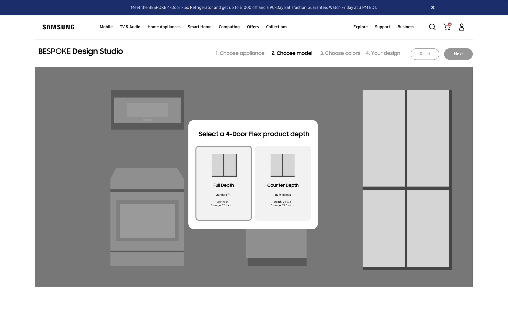
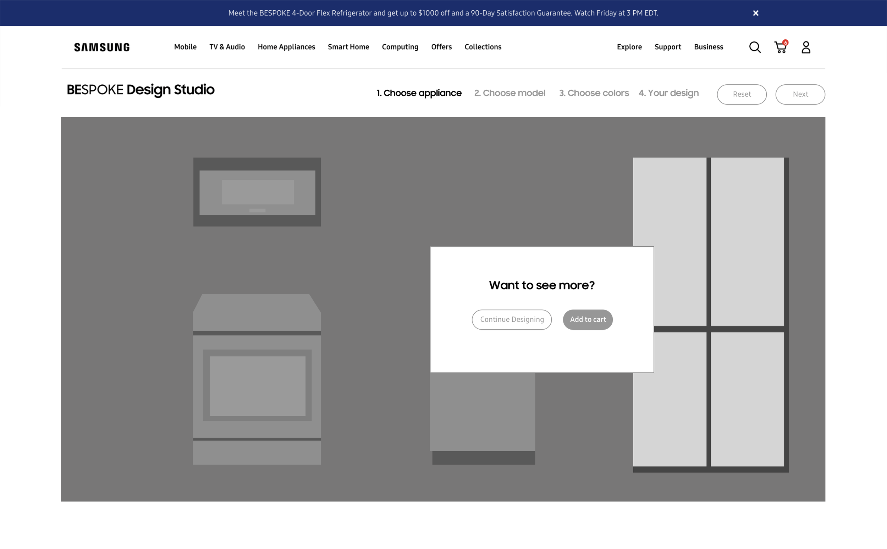
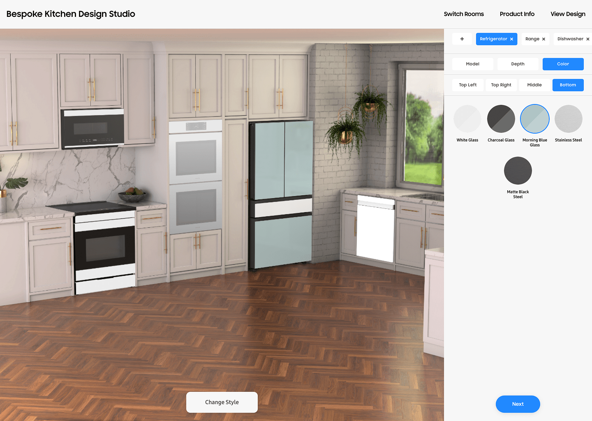
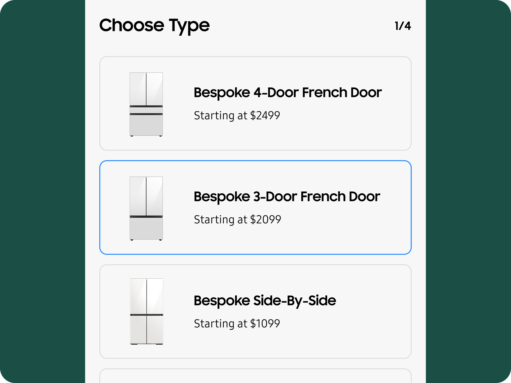

]]]]

# Samsung Bespoke Design Studio

Samsung needed an intuitive, engaging tool that allowed users to personalize their kitchen appliances with confidence. The Bespoke Design Studio was designed to streamline the customization process, making it more accessible and visually inspiring. By prioritizing user experience, we created a platform that not only simplified decision-making but also drove significant business impact.
ClientSamsungRoleAssociate Design DirectorAgencyRazorfishYear2024

## The Challenge

Samsung wanted to bring the hands-on experience of in-store appliance customization to an online platform. In physical stores, customers could see appliance finishes and configurations firsthand, helping them make confident decisions. The goal was to replicate this experience digitally while maintaining the same level of clarity and interactivity.

Achieving this required an intuitive, engaging interface that made customization easy without overwhelming users. I worked closely with UX researchers, engineers, and stakeholders to create a strategy that prioritized simplicity and usability, ensuring a seamless and informative customization journey.

Wireframes

- 

- 

- 

- 

- 

- 

- 

## UX Approach

Research formed the foundation of our design process. Through user behavior analysis, competitor benchmarking, and usability studies, we uncovered insights that shaped a clear, engaging, and accessible experience.

I led the development of wireframes and interactive prototypes, ensuring each iteration refined the customization journey. Collaborating with engineers, I translated design vision into a scalable solution, refining interaction models and micro-interactions to ensure users could personalize appliances effortlessly.

## Design Execution

The Bespoke Design Studio was crafted to offer an immersive and adaptable experience, allowing users to experiment with different styles, colors, and configurations effortlessly.

I led the UI and interaction design, ensuring visual engagement and functional consistency across mobile and desktop. Motion design reinforced user actions with subtle feedback, while educational touchpoints guided users through their decisions. To future-proof the platform, I contributed to a flexible design system that allowed for seamless expansion.

## User Testing & Refinement

Multiple rounds of usability testing refined the design, eliminating friction points and enhancing clarity. I synthesized user feedback to optimize navigation, improve visual hierarchy, and refine accessibility standards, ensuring inclusivity for a diverse audience. Every iteration strengthened the experience, reinforcing our commitment to user-centered design.

- 

- 

- 

- 

## Key Takeaways

Customization at scale requires a balance of flexibility and simplicity. Through research-driven design and iterative refinement, we created a tool that empowers users while driving business growth.

My focus on scalability, usability, and interaction design ensured the Bespoke Design Studio delivered a best-in-class experience, setting a foundation for future innovations in digital customization.
[NextNext

## MyFrontier App
]