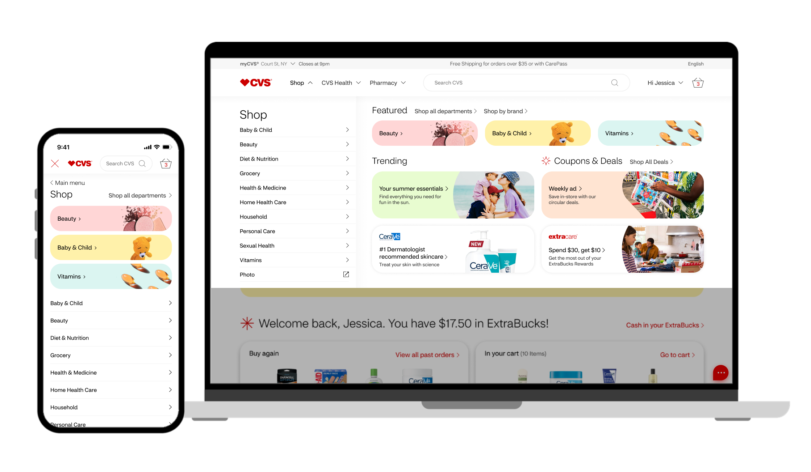
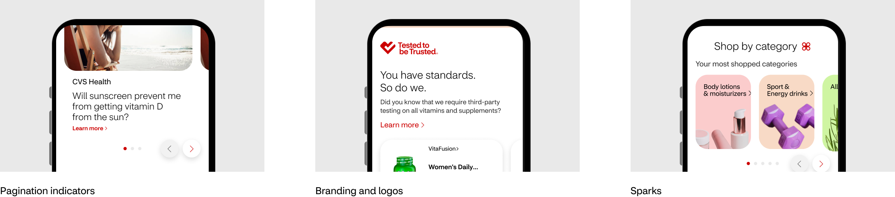

]]]]

# CVS Shop Website Redesign

The CVS online shop needed an update to meet evolving consumer expectations and deliver a more consistent, user-friendly shopping experience. The modernization focused on improving visual clarity, simplifying navigation, and creating a cohesive platform that reflected CVS’s health and wellness positioning.

I contributed to the redesign with a focus on design system foundations. I refined the typographic framework to improve readability and establish clearer hierarchy across key shopping flows. I also designed an icon set to support intuitive wayfinding and helped develop flexible, reusable components that could scale across templates and product experiences. This system-led work supported a cleaner, more modern UI and improved consistency across the site.
ClientCVSRoleAssociate Design DirectorAgencyRazorfishYear2023

[PreviousPrevious

## Samsung.com Redesign
]