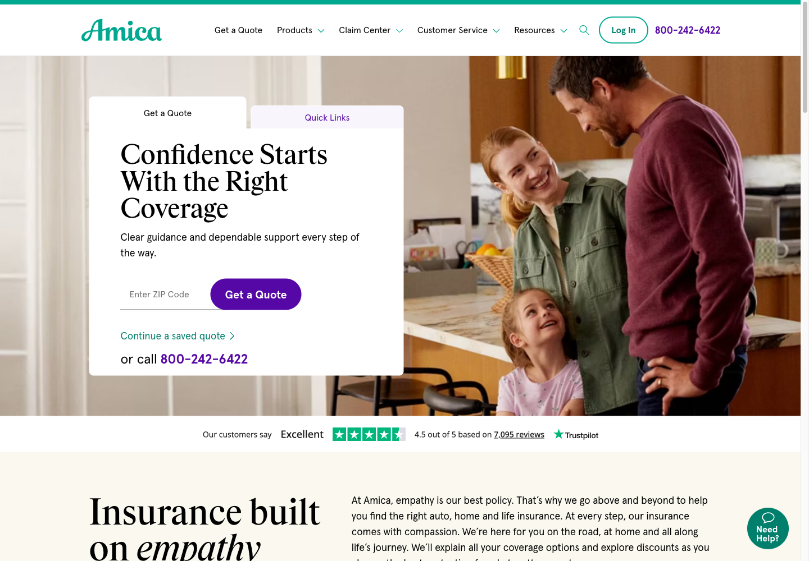
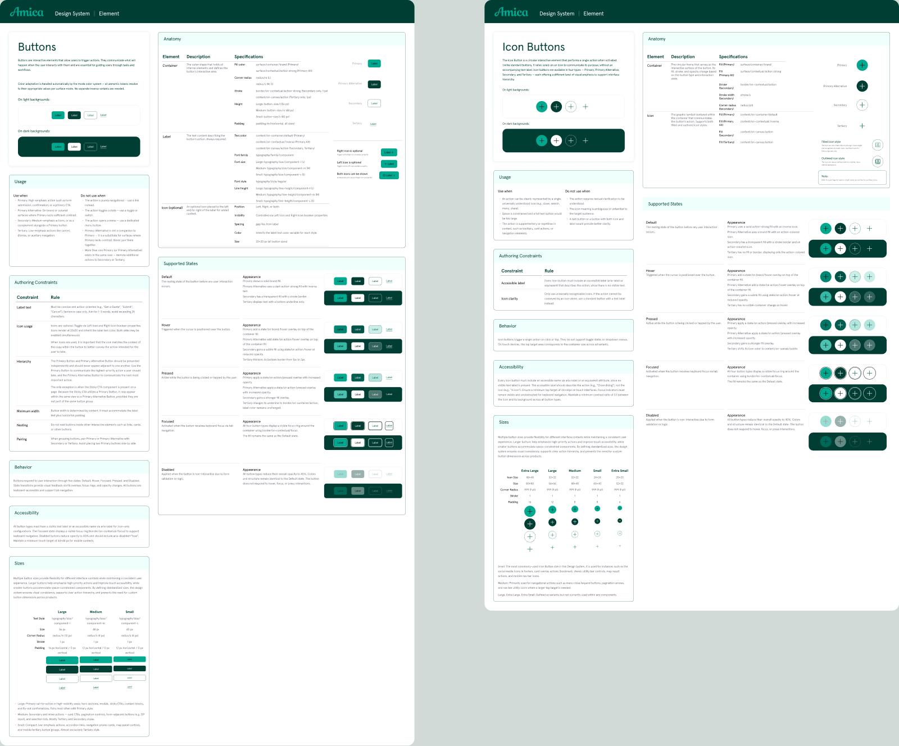
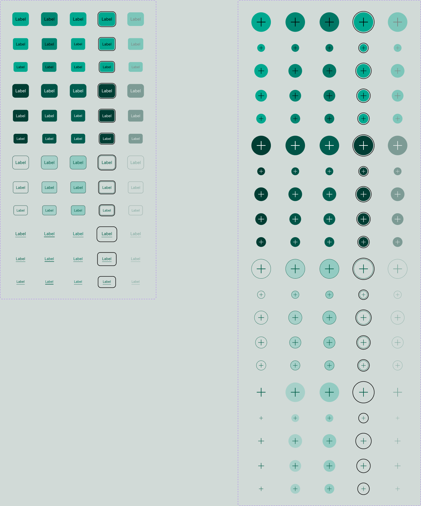

import Meta from '../../components/Meta.astro'
import ProseGroup from '../../components/ProseGroup.astro'
import Figure from '../../components/Figure.astro'
import Carousel from '../../components/Carousel.astro'
import ImageGrid from '../../components/ImageGrid.astro'
import TokenTiers from '../../components/amica/TokenTiers.astro'
import BeforeAfterStats from '../../components/amica/BeforeAfterStats.astro'
import StatCallout from '../../components/amica/StatCallout.astro'
import BenchmarkChart from '../../components/amica/BenchmarkChart.astro'
import HeroMosaic from '../../components/amica/HeroMosaic.astro'
import EmbeddedPrototype from '../../components/amica/EmbeddedPrototype.astro'
import BrowserFrame from '../../components/amica/BrowserFrame.astro'
import prototypeThumb from '../../assets/work/amica-design-system/prototype-v2/quote-thumbnail.jpg'
import ambientHeroThumb from '../../assets/work/amica-design-system/prototype-v2/ambient-hero-thumbnail.jpg'
import quoteFlyoutAddressSrc from '../../assets/work/amica-design-system/prototype-v2/quote-flyout-address-entry.png'
import quoteFlyoutNotAvailableSrc from '../../assets/work/amica-design-system/prototype/quote-flyout-not-available.png'

<HeroMosaic />

<ProseGroup>

# Amica.com Design System

A 615-page redesign was shipping on a design library that was quietly broken: 314,000 nodes, no token system, dead components wired into live pages. I rebuilt the foundation as a data problem, indexed the whole library into a database, benchmarked it against 14 production design systems, and remediated it with a verified pipeline, without pulling the team off a sprint.

</ProseGroup>

<Meta client="Amica" role="Associate Design Director" agency="Razorfish" year={2026} />

<ProseGroup>

## The Audit

I joined four sprints into a rescue: leadership had been split between two people both leading and executing at once, so decisions sat unmade while the work kept piling up. The library was broken in ways no screenshot showed: components filed by page type, color hardcoded instead of bound, instances pointing at masters that no longer existed. So I indexed all 314,000 nodes into a queryable database. The first pass flagged nearly everything as broken, until I separated genuine off-library references from normal nested parts, which dropped the real number to 3,044 flat references and 61 dead masters. The components themselves were sound, so I re-architected the foundation instead of redesigning them.

</ProseGroup>

<ImageGrid columns={1}>

<Figure caption="Amica.com's live site today, still running on the library I inherited. The redesign hasn't shipped yet">

</Figure>

</ImageGrid>

<StatCallout number="314,000" label="Nodes indexed into one queryable database: every component, variable binding, color style, and off-library reference" />

<ProseGroup>

## Decoupling Background From Ink

The biggest-impact move was splitting color into two tiers. Tier 1 is primitives, the raw material, hidden from pickers so designers never touch them directly.

</ProseGroup>

<TokenTiers />

<ProseGroup>

Tier 2 is 54 semantic tokens named by what you're painting, not where you use it, each set for Light and Dark mode. The library had been handling dark mode by duplicating every component into Light and Dark copies, which is how one button ends up with 80 variants. I modeled the modes as variables instead, so a single component carried both, and Icon Button dropped from 80 variants to 60.

I wrote governance into the components themselves. Icon Button carries its own rules: its Extra Small and Small sizes fall under the 44px mobile touch target, so the component marks them desktop-only, and every fill maps to a semantic token.

</ProseGroup>

<Carousel label="Amica button system documentation">

<Figure caption="Buttons and Icon Buttons, documented in the real Figma design system">

</Figure>

<Figure caption="The delivered set: five emphasis levels across every interaction state">

</Figure>

</Carousel>

<ProseGroup>

## Benchmarking Against 14 Production Systems

I didn't trust every instinct on my own, so I indexed 14 production design systems into the same database, 1.4 million nodes. Amica nested the deepest of the set, which turned shallow nesting from a preference into a hard constraint. A study of seven systems' form patterns became my blueprint, and one Amica idea came back validated instead of flagged: modeling breakpoint as a token mode, which none of the others did.

</ProseGroup>

<BenchmarkChart />

<ProseGroup>

## Leading Six Designers Through It

I led by evidence, not seniority. When the brand guide's 100% line height broke on real content, I backed the designer who flagged it and we won the change on accessibility grounds. When a zip-code editor got added to scope after kickoff with no notice to design, I escalated it into a named scope-authority decision instead of letting it slide. When a full-component review collapsed in one room, I read it as a format failure and swapped broad reviews for small alignments. A credentialed accessibility reviewer on the client side pushed back hard more than once, and every push forced a system-level fix.

</ProseGroup>

<ProseGroup>

## The Migration

Fixing 314,000 nodes by hand would have burned the team for weeks. I built an indexing and remediation pipeline with Claude Code: atoms before composites, masters before instances, every write gated by a before-and-after visual diff and verified through a separate read channel, never the one that made the write. It ran alongside the team's sprints; the full tooling story is a companion post, [Indexing a Design System](/blog/indexing-a-design-system).

</ProseGroup>

<BeforeAfterStats />

{/* PROTOTYPE-IMAGES-START */}

<ProseGroup>

## Proof: The System In Code

The library only matters if it survives a browser. I built a React prototype where the Figma tokens drive the Tailwind config, the brand fonts self-hosted, components carrying their Figma node IDs in code comments. The centerpiece is the quote flyout: eight step components driven by a state machine and routed by real ZIP-based availability rules.

</ProseGroup>

<EmbeddedPrototype
  src="/work/amica-design-system/prototype/"
  title="Amica prototype, live"
  label="Live prototype"
  description="Click to open, then click and scroll inside"
  thumbnail={prototypeThumb}
  thumbnailAlt="Amica home insurance product page in the prototype"
/>

<Carousel label="Amica quote flow prototype">

<Figure caption="Quote flyout, ZIP detected">
  <BrowserFrame src={quoteFlyoutAddressSrc} alt="Quote flyout coverage picker with a ZIP code entered and location auto-detected as Forest Hills, NY" />
</Figure>

<Figure caption="Quote flyout, auto unavailable for a Hawaii ZIP">
  <BrowserFrame src={quoteFlyoutNotAvailableSrc} alt="Quote flyout picker with the auto option disabled for a ZIP code where auto insurance isn't sold online" />
</Figure>

</Carousel>

{/* PROTOTYPE-IMAGES-END */}

<ProseGroup>

One more prototype backs this case study: an ambient hero video pipeline that cuts broadcast footage into loop-ready clips with subject-aware cropping. It's a working review tool, not a polished screen, so the toggles at the bottom are part of the demo.

</ProseGroup>

<EmbeddedPrototype
  src="/work/amica-design-system/ambient-hero/"
  title="Ambient hero video pipeline, live"
  label="Live demo"
  description="Desktop / mobile toggle, click to open"
  thumbnail={ambientHeroThumb}
  thumbnailAlt="Ambient hero video pipeline review tool, showing a cropped hero clip and the toggle bar"
/>

<ProseGroup>

## Outcomes

By the end of the engagement, the team was composing new templates from existing components without creating new variants, and running their own alignment sessions without me in the room. The color model eliminated a whole category of variant maintenance, and the token grammar let developers read the Figma file without a translation layer.

The system now governs 76 icons, 130 illustrations, and a 999-asset library with a provenance manifest tracing every asset back to its source.

The redesign hadn't launched yet, so the real test came from a pre-launch concept study, n=500: 62% rated the new direction more trustworthy than the incumbent site, 70% associated it with a premium carrier, and 59% said it increased their intent to request a quote.

</ProseGroup>
