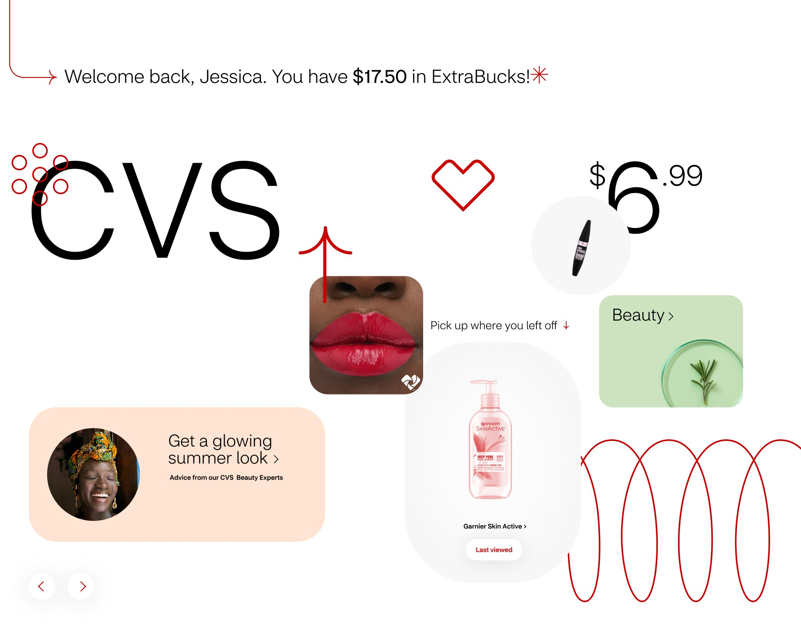
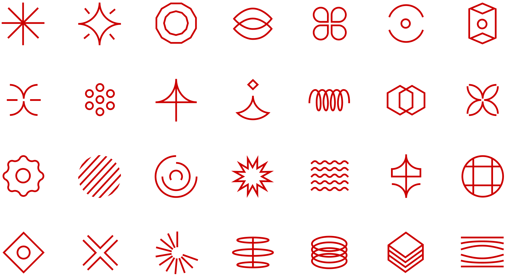
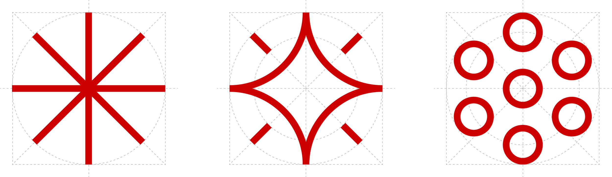
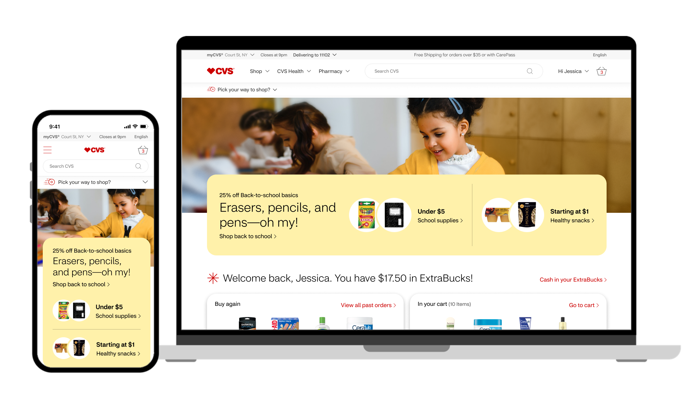
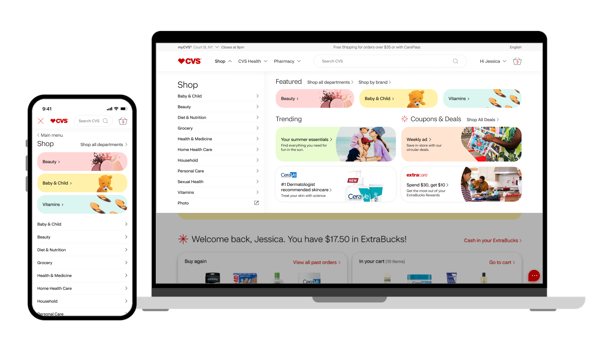
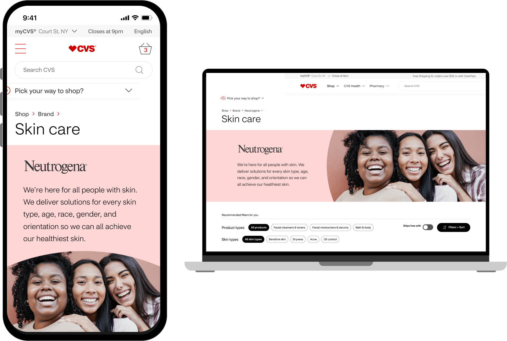
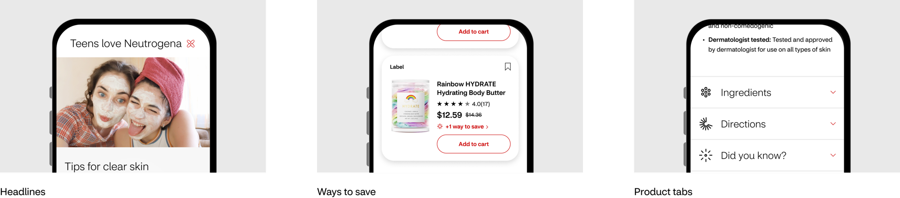
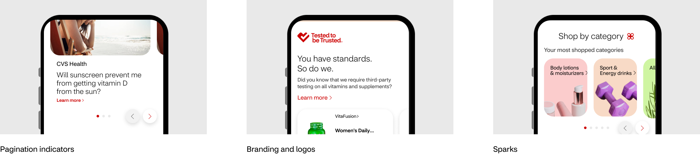

import HeroImage from '../../components/HeroImage.astro'
import Meta from '../../components/Meta.astro'
import ImagePair from '../../components/ImagePair.astro'
import ProseGroup from '../../components/ProseGroup.astro'
import Figure from '../../components/Figure.astro'
import ZigzagSection from '../../components/ZigzagSection.astro'
import AccentBand from '../../components/AccentBand.astro'
import heroSrc from '../../assets/work/cvs-redesign/cvs-header-2.jpg'

<HeroImage src={heroSrc} alt="CVS Shop Website Redesign project showcase" />

<ProseGroup>

# CVS Shop Website Redesign

Composable primitives over page-specific components. CVS.com had accumulated years of inconsistency across acquisitions. I owned the type system, the icon system, the component library, and the overall design direction. The approach was composable primitives rather than page-specific components, so teams could assemble freely.

</ProseGroup>

<Meta client="CVS" role="Associate Design Director" agency="Razorfish" year={2023} />

<ZigzagSection>
  <Fragment slot="media">
    
  </Fragment>
  <ProseGroup>

  ## Typography & Icons

  I designed a type system with a rational scale and a grid-based icon and illustration system using CVS brand red. Each icon was constructed on a consistent grid so proportions held at any size. No one-off sizing decisions. The type scale and icon grid became the foundation everything else was built on.

  </ProseGroup>
</ZigzagSection>

<ProseGroup>

## The Problem

CVS sits at an unusual intersection: pharmacy and general retailer. That means the platform serves a wider range of intent than most e-commerce sites. Over time, the shop grew through acquisitions rather than deliberate system thinking, producing fractured type scales, inconsistent icons, and components built independently rather than from shared parts. Because CVS.com is a live platform with real customer volume, fixing it required discipline: I couldn't redesign from scratch. I had to build shared parts that made every downstream page more consistent without breaking what was live.

</ProseGroup>

<ImagePair>
  <Fragment slot="left"></Fragment>
  <Fragment slot="right"></Fragment>
</ImagePair>

<ProseGroup>

## The Work

I chose composable primitives over page-specific components. That was the key decision: rather than designing a "homepage hero" or a "category card," I built atomic pieces (type scale, icon grid, spacing system) that any team could assemble into what they needed. Starting with the typographic framework meant every downstream component inherited consistency rather than having to engineer it in later. The icon system followed the same principle: every icon built on a grid, using CVS brand red, so proportions held at any size without case-by-case adjustment.

</ProseGroup>

<ZigzagSection reversed>
  <Fragment slot="media">
    
  </Fragment>
  <ProseGroup>

  ## Components & Templates

  The component library covered homepage modules, product pages, and category navigation. Each piece was built to work across desktop and mobile from the start, preventing the usual pattern of designing desktop first and adapting after the fact.

  </ProseGroup>
</ZigzagSection>

<ImagePair>
  <Fragment slot="left"></Fragment>
  <Fragment slot="right"></Fragment>
</ImagePair>

<ProseGroup>

## What I Learned

When the typographic scale is resolved, product teams stop making ad hoc sizing decisions. When the icon system is consistent, no one debates stroke weight. The system removed the decisions that shouldn't vary: type sizes, icon proportions, spacing. That freed teams to focus on pharmacy flows and checkout.

</ProseGroup>
