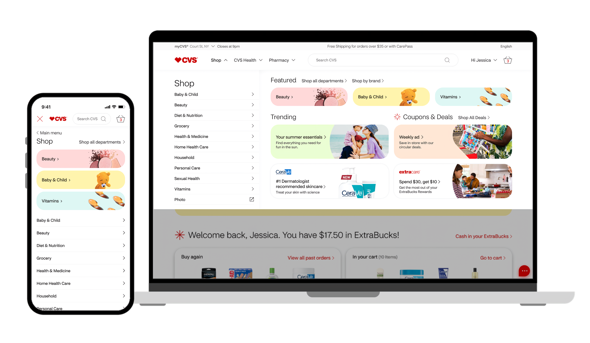
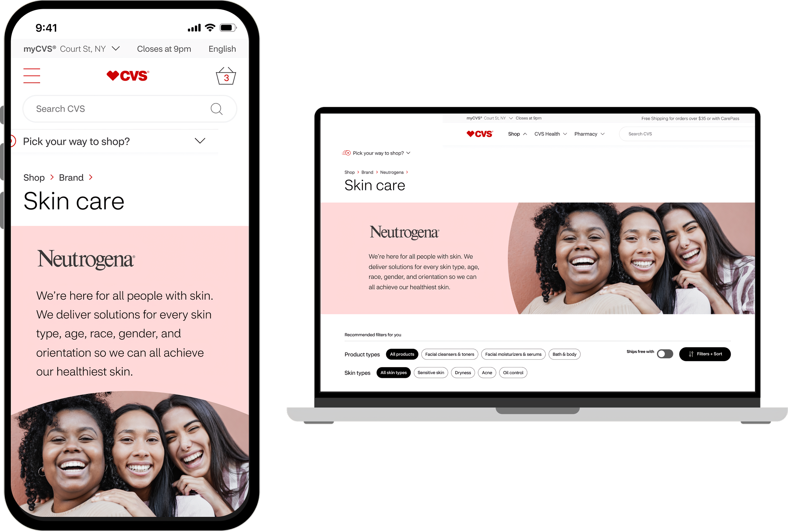

import HeroImage from '../../components/HeroImage.astro'
import { Image } from 'astro:assets'
import Meta from '../../components/Meta.astro'
import ImagePair from '../../components/ImagePair.astro'
import ProseGroup from '../../components/ProseGroup.astro'
import Figure from '../../components/Figure.astro'
import ZigzagSection from '../../components/ZigzagSection.astro'
import AccentBand from '../../components/AccentBand.astro'
import heroSrc from '../../assets/work/cvs-redesign/cvs-header-2.jpg'
import brandVisualLanguageSrc from '../../assets/work/cvs-redesign/group-10624.jpg'
import iconIllustrationSystemSrc from '../../assets/work/cvs-redesign/frame-10558.png'
import iconConstructionSrc from '../../assets/work/cvs-redesign/frame-10629.png'
import homepageResponsiveLayoutSrc from '../../assets/work/cvs-redesign/frame-10669.png'
import uiComponentsHeadlinesSrc from '../../assets/work/cvs-redesign/frame-10630.png'
import uiComponentsPaginationSrc from '../../assets/work/cvs-redesign/frame-10608.png'

<HeroImage src={heroSrc} alt="CVS Shop Website Redesign project showcase" />

<ProseGroup>

# CVS Shop Website Redesign

CVS.com had years of inconsistency from acquisitions. I led the type system, the icon system, the component library, and the overall design direction. The approach was composable primitives rather than page-specific components, so teams could assemble what they needed.

</ProseGroup>

<Meta client="CVS" role="Associate Design Director" agency="Razorfish" year={2023} />

<ZigzagSection>
  <Fragment slot="media">
    <Image src={brandVisualLanguageSrc} alt="Brand visual language showing CVS design elements and UI patterns" format="webp" />
  </Fragment>
  <ProseGroup>

  ## Typography & Icons

  I designed a type system with a rational scale and a grid-based icon and illustration system using CVS brand red. Each icon was constructed on a consistent grid so proportions held at any size. No one-off sizing decisions. The type scale and icon grid became the foundation everything else was built on.

  </ProseGroup>
</ZigzagSection>

<ProseGroup>

## The Problem

CVS sits at an unusual intersection: pharmacy and general retailer. That means the platform serves a wider range of intent than most e-commerce sites. Over time, the shop grew through acquisitions rather than deliberate system thinking, producing fractured type scales, inconsistent icons, and components built independently rather than from shared parts. Because CVS.com is a live platform with real customer volume, fixing it required discipline: I couldn't redesign from scratch. I had to build shared parts that made every downstream page more consistent without breaking what was live.

</ProseGroup>

<ImagePair>
  <Fragment slot="left"><Image src={iconIllustrationSystemSrc} alt="Icon and illustration system, geometric shapes built for the CVS brand" format="webp" /></Fragment>
  <Fragment slot="right"><Image src={iconConstructionSrc} alt="Icon construction, grid-based build process for consistent sizing" format="webp" /></Fragment>
</ImagePair>

<ProseGroup>

## The Work

The key decision was building atomic pieces rather than page-specific components. Instead of designing a "homepage hero" or a "category card," I built the type scale, icon grid, and spacing system so any team could assemble what they needed. Starting with the typographic framework meant every downstream component inherited consistency rather than having to engineer it in later. The icon system followed the same principle: every icon built on a grid, using CVS brand red, so proportions held at any size without case-by-case adjustment.

</ProseGroup>

<ZigzagSection reversed>
  <Fragment slot="media">
    <Image src={homepageResponsiveLayoutSrc} alt="CVS.com homepage, desktop and mobile responsive layout" format="webp" />
  </Fragment>
  <ProseGroup>

  ## Components & Templates

  The component library covered homepage modules, product pages, and category navigation. Each piece was built to work across desktop and mobile from the start, preventing the usual pattern of designing desktop first and adapting after the fact.

  </ProseGroup>
</ZigzagSection>

<ImagePair>
  <Fragment slot="left"><Image src={uiComponentsHeadlinesSrc} alt="UI components including headlines, product cards, and product tabs" format="webp" /></Fragment>
  <Fragment slot="right"><Image src={uiComponentsPaginationSrc} alt="UI components including pagination, branding elements, and category navigation" format="webp" /></Fragment>
</ImagePair>

<ProseGroup>

## What I Learned

The biggest lesson was restraint. On a live platform with real customer volume, the instinct is to redesign everything. But the constraint of not breaking what was live forced better thinking: build the smallest possible shared parts, and let consistency propagate through adoption rather than mandates. The teams that picked up the system fastest were the ones who felt the pain of the old fragmentation most. I didn't have to sell them on it. The system sold itself once it removed decisions they were tired of making.

</ProseGroup>
