import HeroImage from '../../components/HeroImage.astro'
import Meta from '../../components/Meta.astro'
import LottiePlayer from '../../components/LottiePlayer.astro'
import ProseGroup from '../../components/ProseGroup.astro'
import Figure from '../../components/Figure.astro'
import Carousel from '../../components/Carousel.astro'
import ImagePair from '../../components/ImagePair.astro'
import ZigzagSection from '../../components/ZigzagSection.astro'
import AccentBand from '../../components/AccentBand.astro'
import heroSrc from '../../assets/work/myfrontier-app/frontier-app-kv.png'

<HeroImage src={heroSrc} alt="MyFrontier App Redesign — project showcase" />

<ProseGroup>

# MyFrontier App Redesign

Motion that earns its place by solving specific user anxiety. The MyFrontier app covered bill pay, account management, technician scheduling, and support, but the experience didn't hold together. On a small team close to dev, I rebuilt the visual design, defined the layout system, and created a motion language from scratch to give users confidence when they needed it most.

</ProseGroup>

<Meta client="Frontier" role="Associate Design Director" agency="Razorfish" year={2024} />

<ImagePair>
  <Fragment slot="left">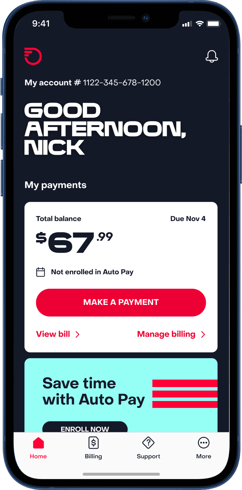</Fragment>
  <Fragment slot="right">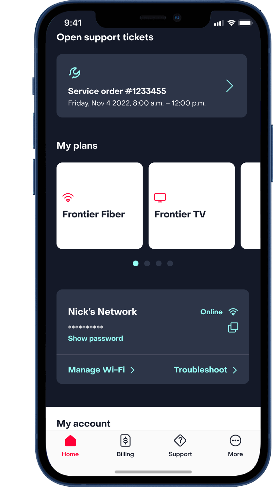</Fragment>
</ImagePair>

<ProseGroup>

## Interface Design

I designed every core screen: onboarding, dashboard, bill pay, and support. The layout system prioritised information hierarchy. The most important action on each screen got the most visual weight, and secondary actions were consistently grouped so users built muscle memory across flows.

</ProseGroup>

<Carousel label="Frontier app intro screens">

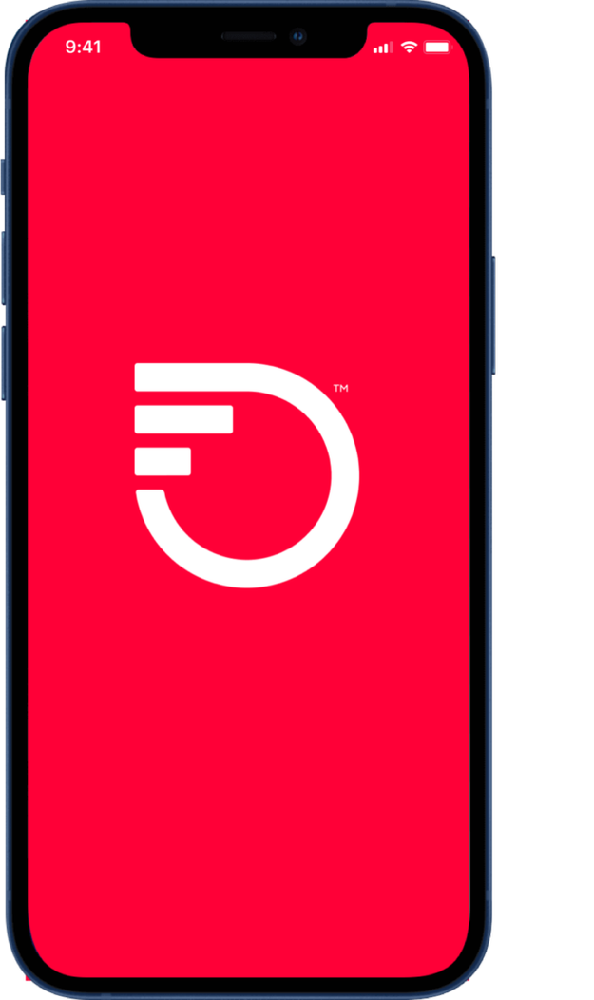

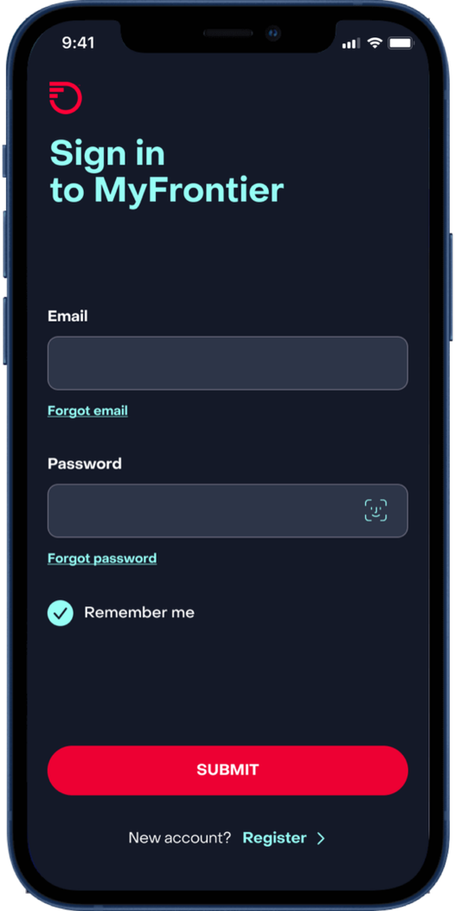

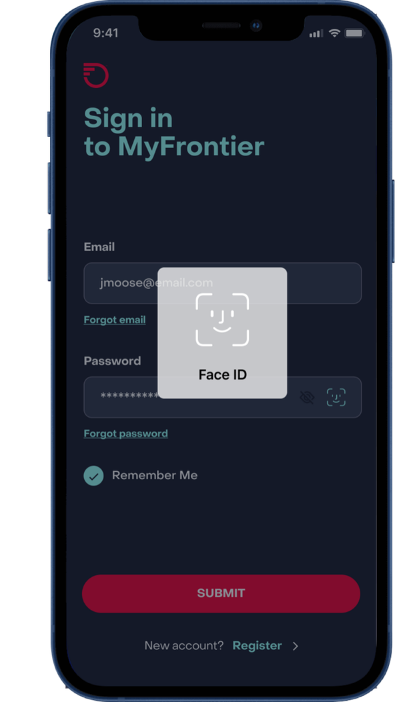

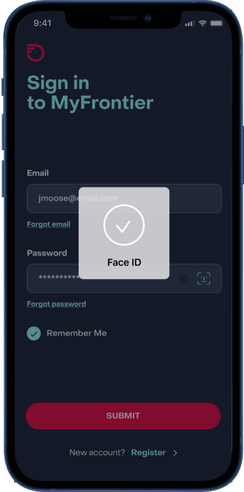

</Carousel>

<ProseGroup>

## The Problem

Nobody opens a telecom app to browse. They open it because they have a question about their bill, because a technician is coming, or because their internet is down. The MyFrontier app had accumulated inconsistencies over years: layouts that varied flow to flow, controls that gave no feedback, and zero motion. Every fix had to respect those stakes. People in a bad moment shouldn't have to think about the interface.

</ProseGroup>

<Carousel label="Bill pay flow">

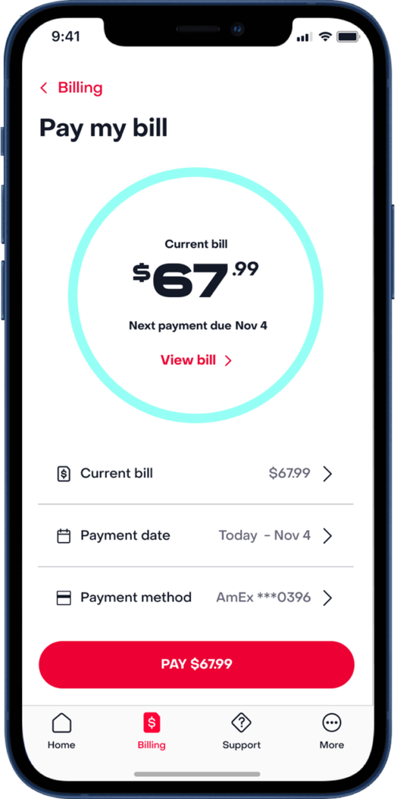

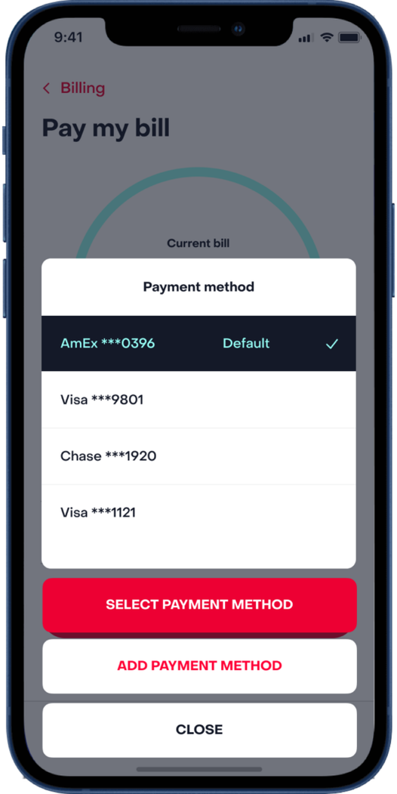

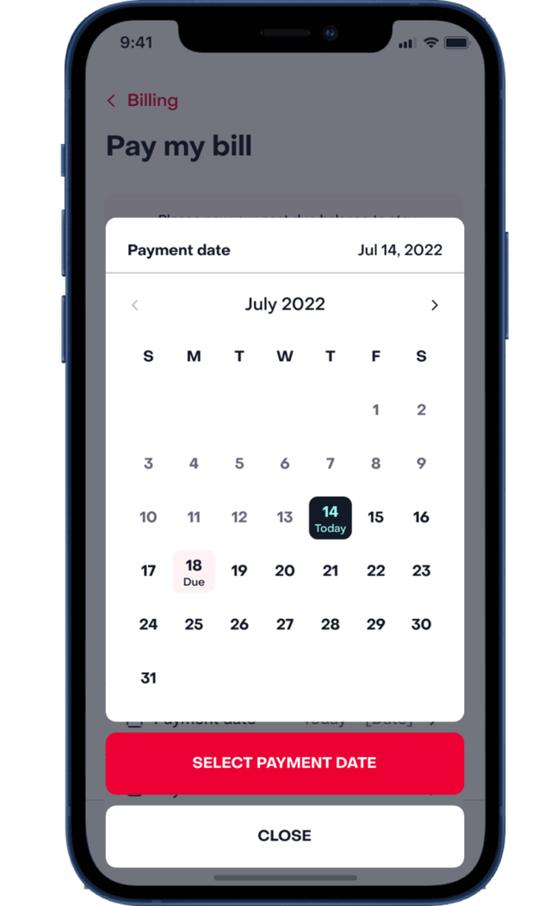

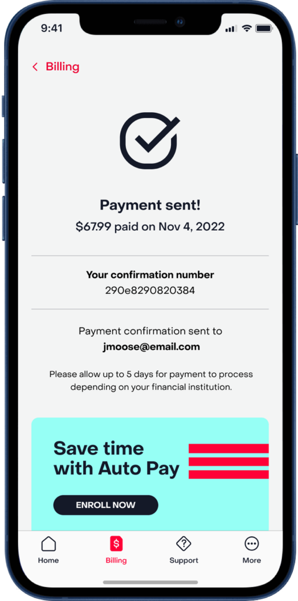

</Carousel>

<ProseGroup>

## The Work

I owned layout design across every screen and defined visual hierarchy for core UI components: navigation, appointment calendar, and selector patterns throughout bill pay and account management. The structural decisions (information priority per screen, element sizing matched to confidence rather than just thumb reach, consistent control grouping) made the app feel like a single product. Alongside that, I built a motion system by mapping uncertainty moments ("did my payment go through?", "is my appointment confirmed?") and designing animations to resolve each one.

</ProseGroup>

<Carousel label="Support and scheduling flow">

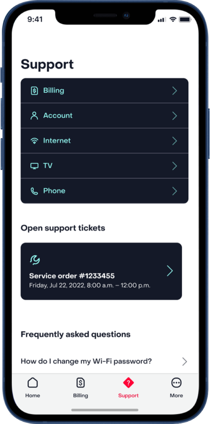

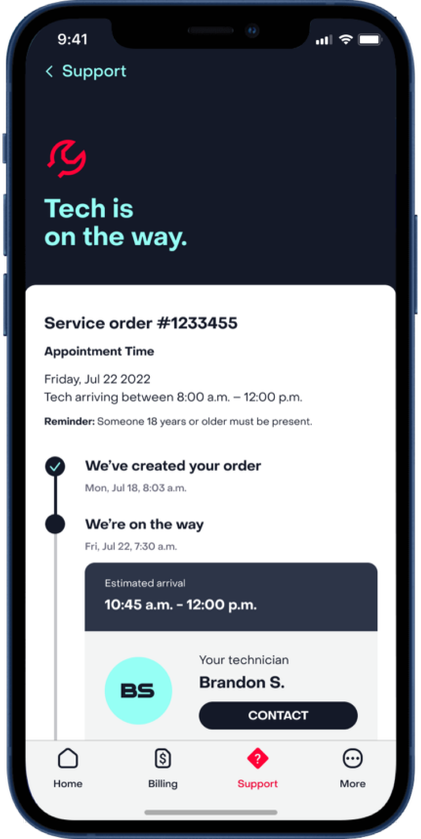

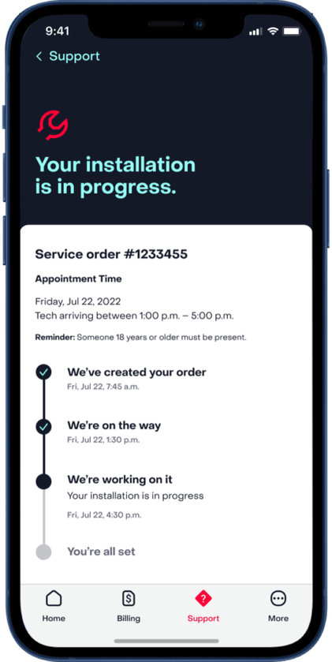

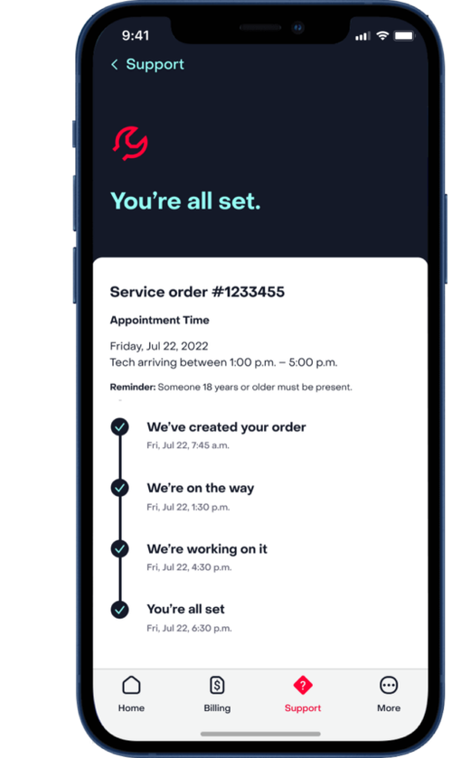

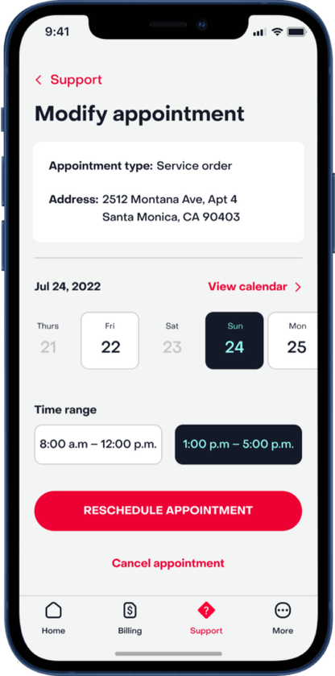

</Carousel>

<ProseGroup>

## Motion Design

I built every Lottie file personally. After Effects compositions exported through the Lottie pipeline. Each animation mapped to a specific uncertainty moment: the coin confirmed a payment was processing, the leaf signalled setup completion, and the intro sequence covered the initial data load so the app felt responsive from the first tap. I delivered motion specs alongside the files: easing values, timing, and documentation so dev could implement without guesswork.

</ProseGroup>

  <LottiePlayer src="src/lottie/Lottie-Intro.json" label="App launch" maxWidth="100%" />
  <LottiePlayer src="src/lottie/Lottie-Coin.json" label="Payment confirmation" maxWidth="100%" />
  <LottiePlayer src="src/lottie/Lottie-Leaf.json" label="Setup complete" maxWidth="100%" />
  <LottiePlayer src="src/lottie/Lottie-Confirmation.json" label="Confirmation" maxWidth="100%" />

<ProseGroup>

## What I Learned

In a utility app, the user's trust is already conditional. A telecom app can't afford animation that says "look at us." Each animation had to earn its place by solving a specific problem. That constraint produced a tighter, more purposeful motion system than most projects get. The motion specs and dev handoff documentation mattered as much as the animations themselves. Without clear easing values and timing, the implementation would have drifted from the intent.

</ProseGroup>
