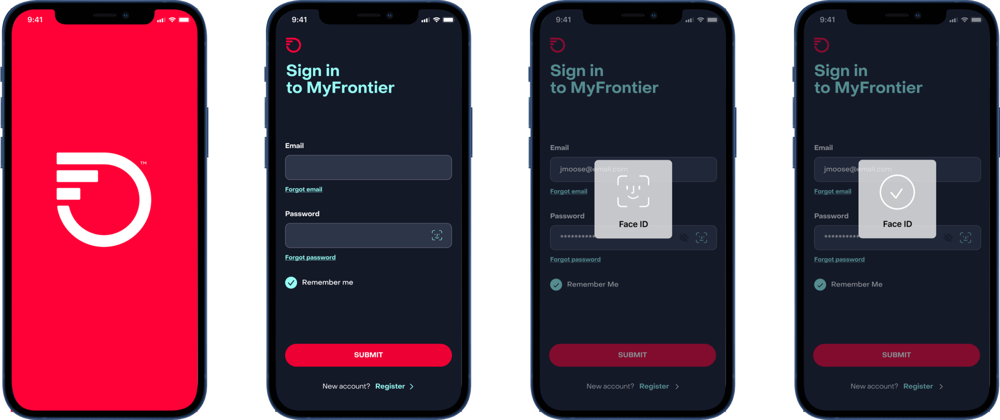
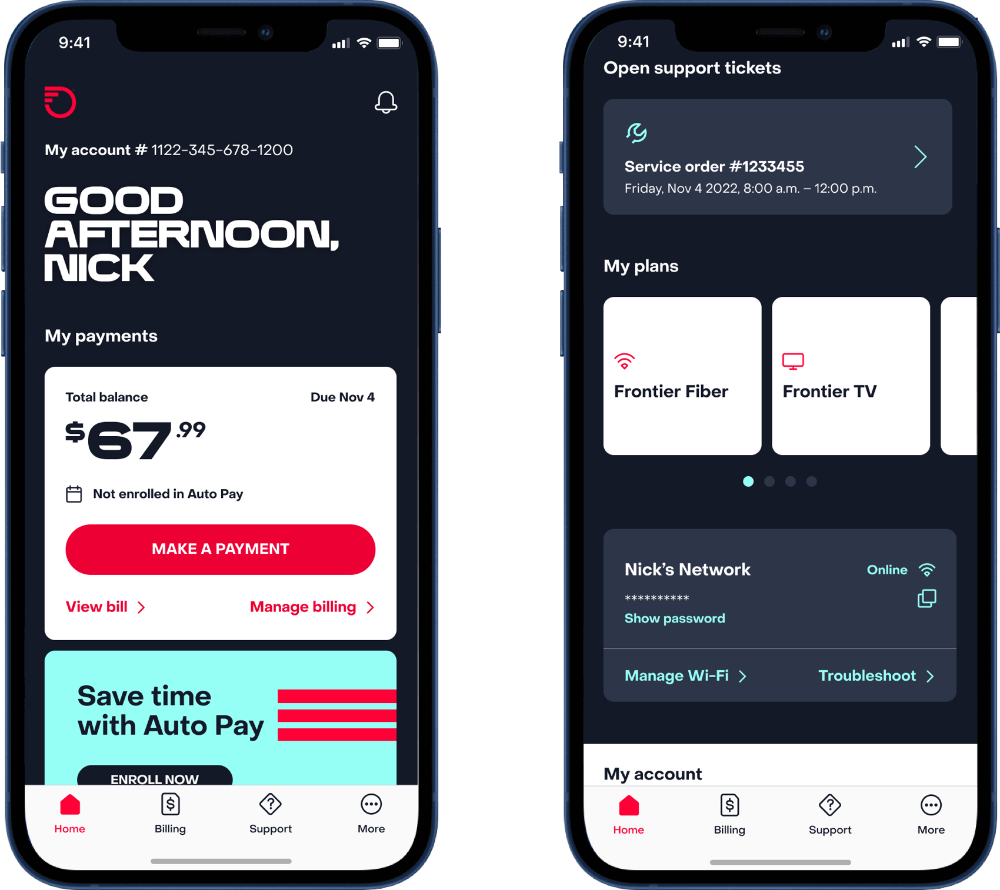
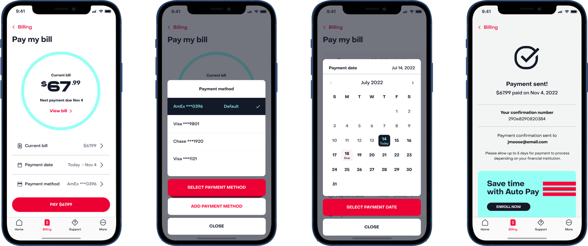
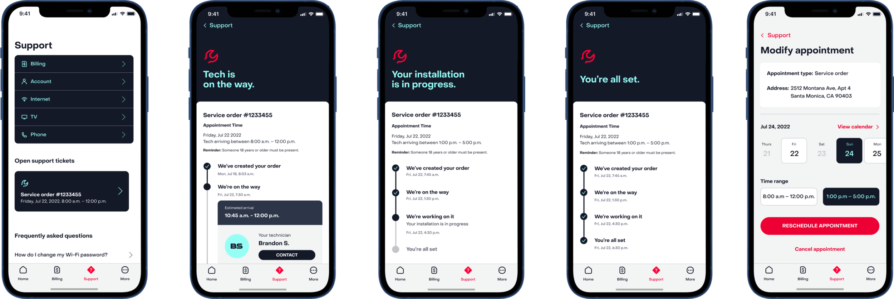

import HeroImage from '../../components/HeroImage.astro'
import Meta from '../../components/Meta.astro'
import LottiePlayer from '../../components/LottiePlayer.astro'
import ProseGroup from '../../components/ProseGroup.astro'
import heroSrc from '../../assets/work/myfrontier-app/frontier-app-kv.png'

<HeroImage src={heroSrc} alt="MyFrontier App Redesign — project showcase" />

<Meta client="Frontier" role="Associate Design Director" agency="Razorfish" year={2024} />

<ProseGroup>

# MyFrontier App Redesign

The MyFrontier app covered bill pay, account management, technician scheduling, and support — but the experience didn't hold together. Screens felt inconsistent, navigation was unclear, and users were hitting friction at exactly the moments they could least afford it. The redesign rebuilt it from the layout up.

</ProseGroup>

<ProseGroup>

## The Problem

Utility apps live at the worst end of the emotional spectrum. Nobody opens a telecom app to browse. They open it because they have a question about their bill, because a technician is coming and they need to confirm the window, or because their internet is down and they need answers fast. In that context, the bar for design isn't delight — it's don't slow people down. The MyFrontier app had accumulated inconsistencies across years: menus that didn't follow a clear hierarchy, screen layouts that varied from flow to flow, and interactions that gave no feedback. There was no shared visual language, and no motion system at all. Every fix had to respect those real-world stakes — people in a bad moment shouldn't have to think about the interface.

</ProseGroup>

<ProseGroup>

## The Work

As ADD, I owned layout design across multiple screens and defined visual hierarchy for core UI components: the navigation menu, the appointment calendar, and the selector patterns used throughout bill pay and account management. The goal was a consistent structural logic that could hold across very different types of tasks — from scheduling a technician visit to reviewing a payment history.

Hierarchy decisions weren't cosmetic. Putting the right information at the top of each screen, sizing interactive elements to match confidence not just thumb reach, and grouping related controls consistently — these were the moves that made the app feel like a single product rather than a collection of individual screens. I built a motion design system to run alongside it.

</ProseGroup>

### Interface Design

<ProseGroup>

### Motion Design

Motion gave users immediate feedback that their actions went through. A coin animation confirmed a payment, a leaf marked a completed setup, and the intro sequence covered the initial load so the app felt responsive from the first tap.

</ProseGroup>

  <LottiePlayer src="src/lottie/Lottie-Intro.json" label="App launch animation" />
  <LottiePlayer src="src/lottie/Lottie-Coin.json" label="Payment confirmation" />
  <LottiePlayer src="src/lottie/Lottie-Leaf.json" label="Setup completion" />
  <LottiePlayer src="src/lottie/Lottie-Confirmation.json" label="General confirmation" />

<ProseGroup>

## What I Learned

Each animation in the system was solving a specific problem, not adding polish. The coin confirmed that a payment actually processed — removing the uncertainty that makes people tap "submit" twice. The leaf gave setup completion a distinct visual endpoint, so users knew they were done rather than wondering if there was another step. The intro sequence wasn't a splash screen; it was time-buying cover for the initial data load, so the first interaction the user had with the app felt instant. That distinction matters more in a utility app than anywhere else. A brand experience can afford an animation that says "look at us." A telecom app can't — the user's trust is already conditional. The motion had to earn its place by doing something specific, and that constraint produced a tighter, more purposeful system than most projects get.

</ProseGroup>
