import HeroImage from '../../components/HeroImage.astro'
import Meta from '../../components/Meta.astro'
import ImagePair from '../../components/ImagePair.astro'
import ProseGroup from '../../components/ProseGroup.astro'
import Carousel from '../../components/Carousel.astro'
import Figure from '../../components/Figure.astro'
import ImageGrid from '../../components/ImageGrid.astro'
import ZigzagSection from '../../components/ZigzagSection.astro'
import AccentBand from '../../components/AccentBand.astro'
import heroSrc from '../../assets/work/samsung-redesign/revamp-kv.jpg'

<HeroImage src={heroSrc} alt="Samsung.com Redesign project showcase" />

<ProseGroup>

# Samsung.com Redesign

I contributed to three areas of Samsung.com: the design system, page layouts, and the global navigation bar. The GNB was the hardest problem, and where I spent the most time.

</ProseGroup>

<Meta client="Samsung" role="Senior Designer" agency="Razorfish" year={2021} />

<ZigzagSection>
  <Fragment slot="media">
    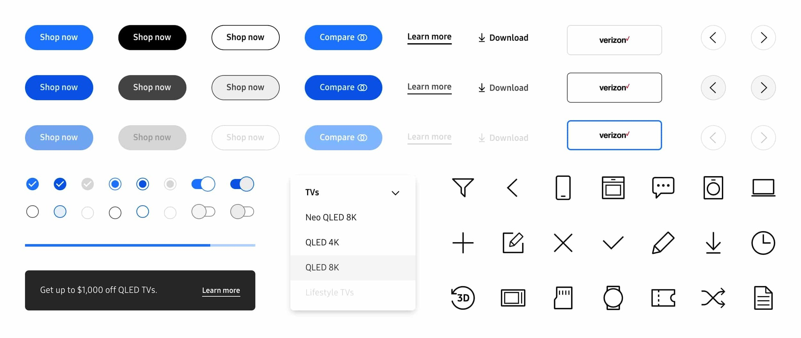
  </Fragment>
  <ProseGroup>

  ## Design System

  I contributed atoms and components to Samsung's design system: pieces that regional teams could compose into market-specific pages without breaking brand consistency. The system had to hold across 12+ markets while accommodating different content lengths, imagery, and promotional structures.

  </ProseGroup>
</ZigzagSection>

<ProseGroup>

## The Problem

Samsung.com's navigation had accumulated complexity from years of market-by-market additions. Different product catalogues meant different category hierarchies. Different languages meant different string lengths and overflow behaviors. Right-to-left scripts flipped the entire spatial logic. The existing GNB had grown organically and it showed. Every market had its own workarounds. The challenge was designing a navigation architecture strict enough to read as one brand globally, but flexible enough that no market needed to break it.

</ProseGroup>

<ImagePair>
  <Fragment slot="left">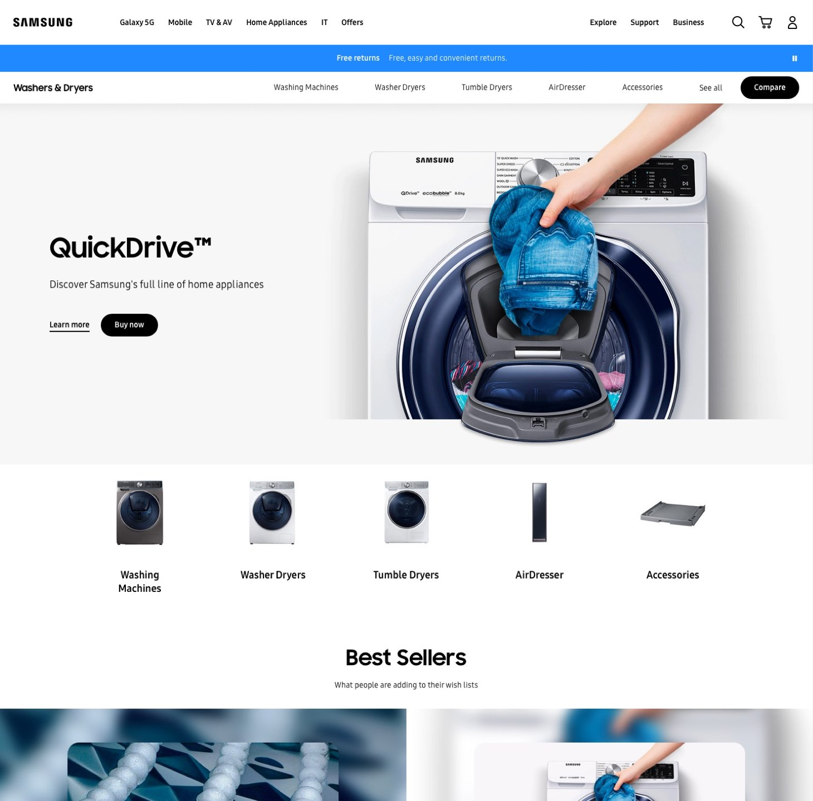</Fragment>
  <Fragment slot="right">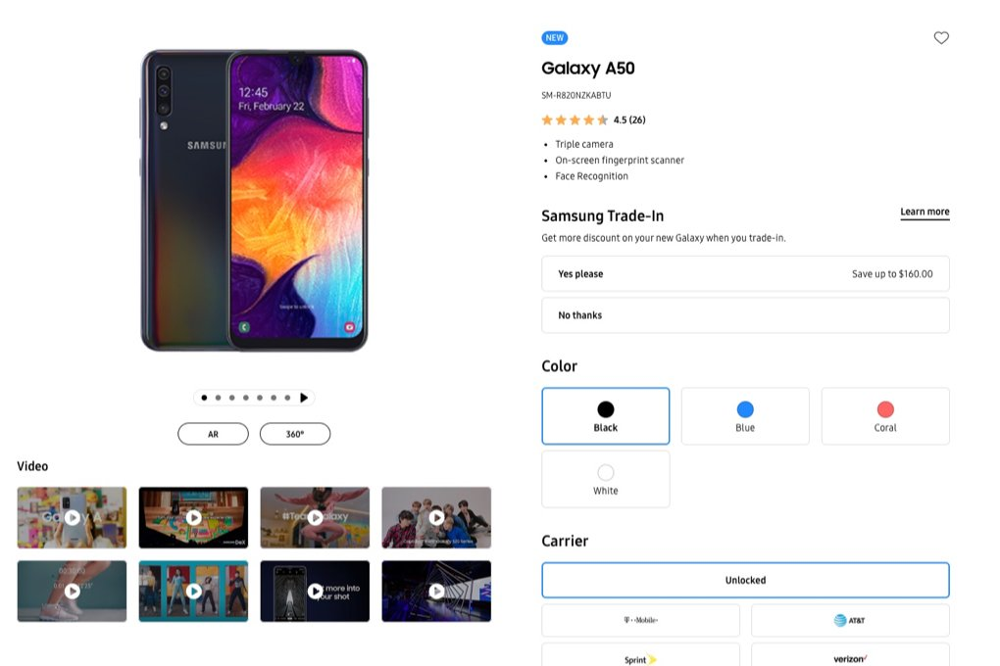</Fragment>
</ImagePair>

<ProseGroup>

## The Work

I moved between roles on this project. I designed GNB variations and prototyped them, built page layouts to Samsung's brand standards, and contributed design system atoms and components. Every iteration had to hold up across Samsung's full range of markets: different script directions, catalogue depths, and nav item counts. Designing for a single locale was never an option.

</ProseGroup>

<Carousel label="Samsung product pages">

<Figure caption="Product showcase">
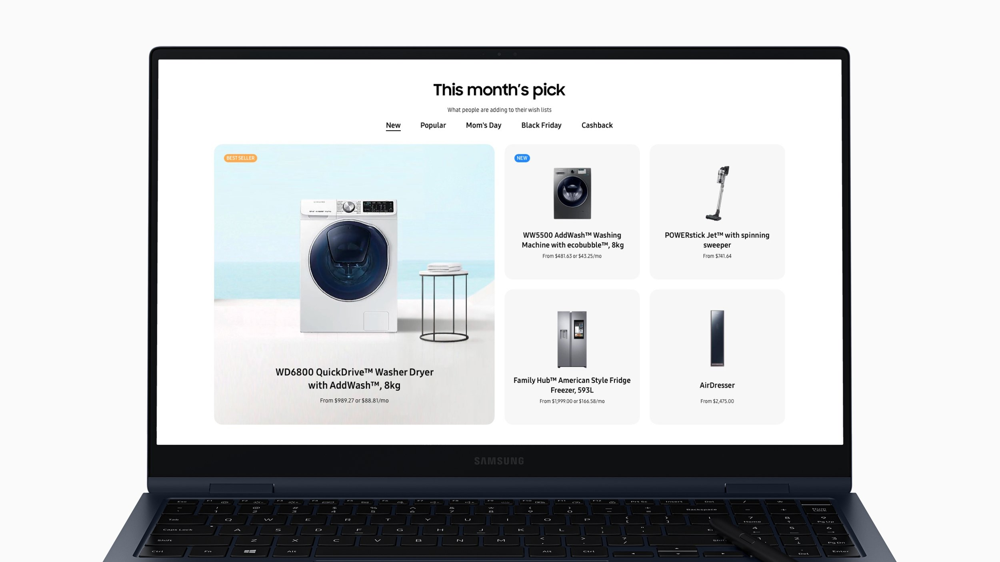
</Figure>

<Figure caption="Product detail">
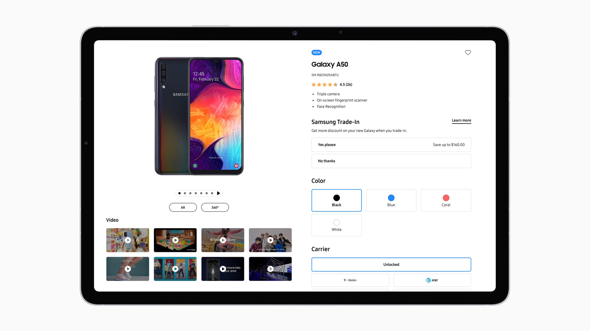
</Figure>

<Figure caption="Product finder">
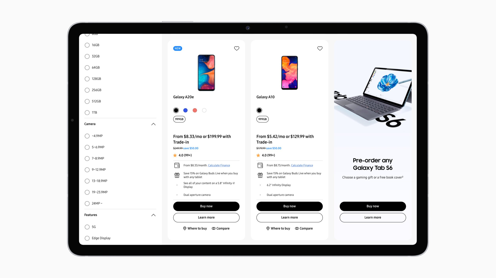
</Figure>

</Carousel>

<ZigzagSection reversed>
  <Fragment slot="media">
    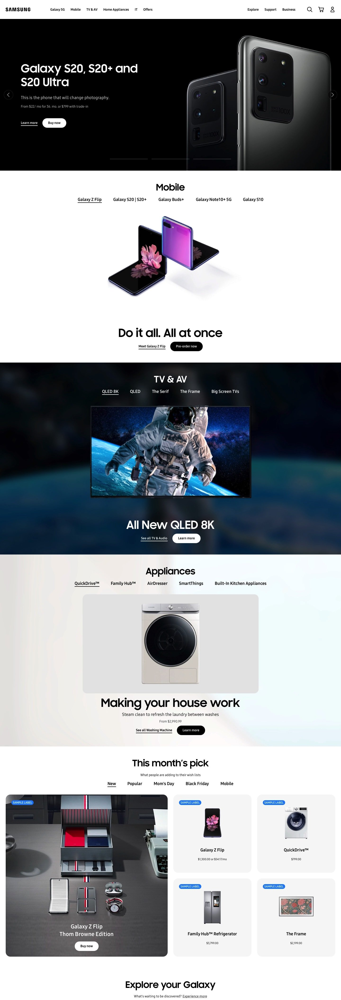
  </Fragment>
  <ProseGroup>

  ## Page Layouts

  I designed page layouts across Samsung.com's core page types: homepage, product detail, product category, and product family. Each had to work within Samsung's rigid brand guidelines while serving its specific user intent. The homepage drove discovery, product pages drove purchase confidence, and category pages needed to handle wildly different catalogue sizes per market.

  </ProseGroup>
</ZigzagSection>

<ImageGrid columns={2}>

<Figure>
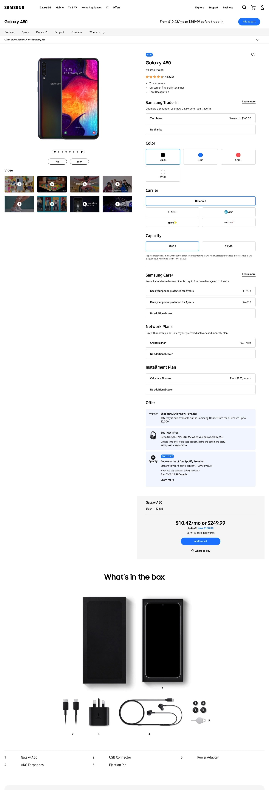
</Figure>

<Figure>
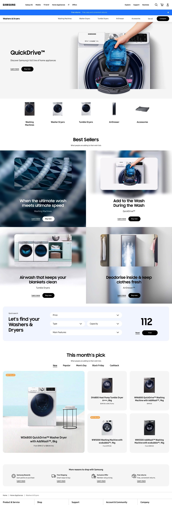
</Figure>

<Figure>
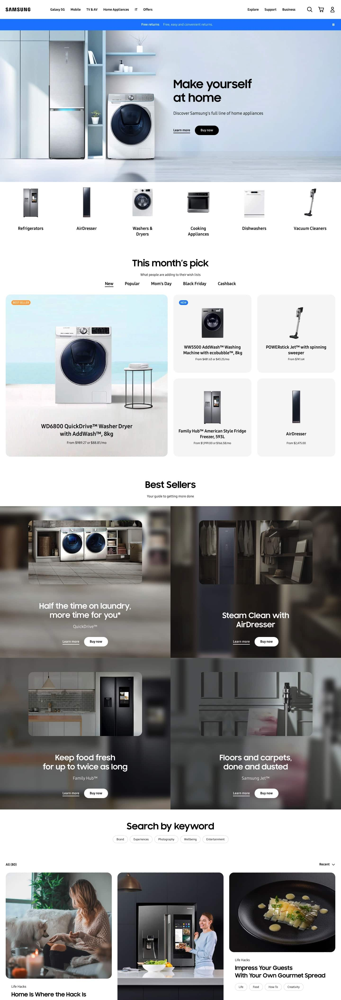
</Figure>

<Figure>

</Figure>

</ImageGrid>

<ZigzagSection>
  <Fragment slot="media">
    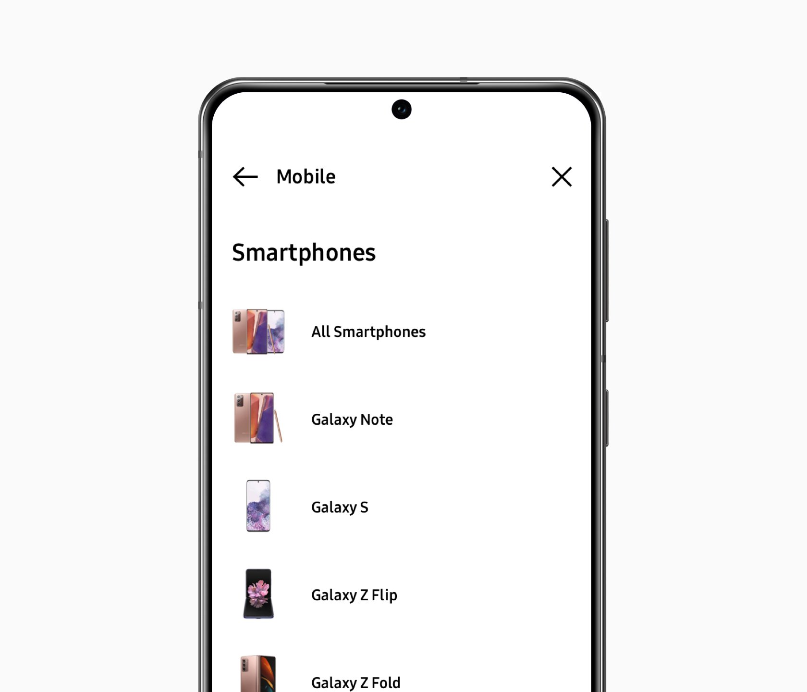
  </Fragment>
  <ProseGroup>

  ## Global Navigation

  Samsung's navigation had too many levels. The challenge was cutting depth without hiding products. I prototyped variations and stress-tested each against right-to-left scripts, deep catalogue hierarchies, and long nav item lists. The goal was one navigation architecture that no market needed to fork.

  </ProseGroup>
</ZigzagSection>

<ImagePair>
  <Fragment slot="left">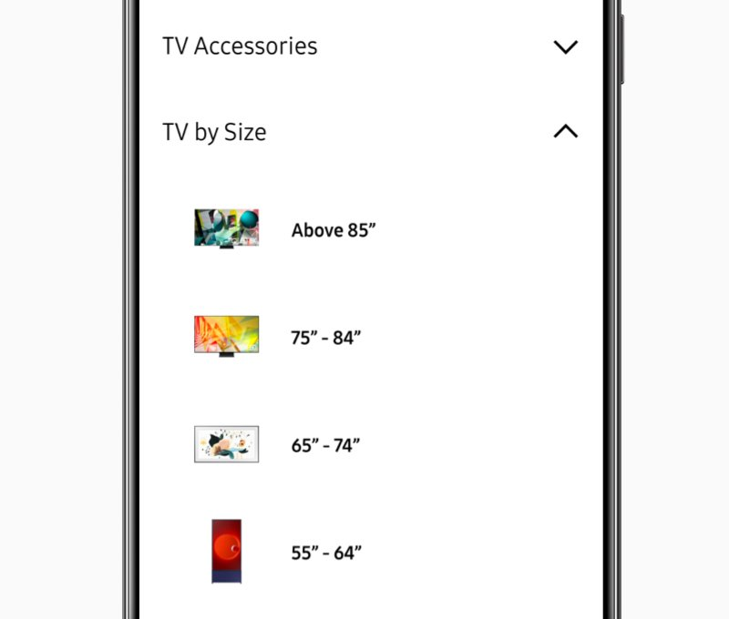</Fragment>
  <Fragment slot="right">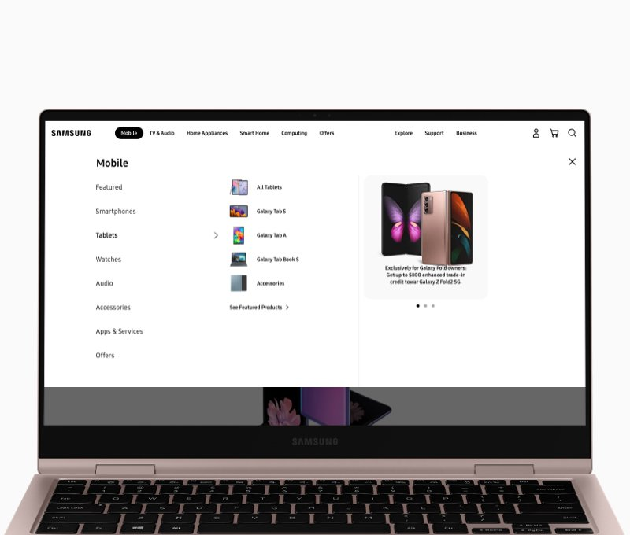</Fragment>
</ImagePair>

<ProseGroup>

## What I Learned

The GNB problem was information architecture before it was visual design. Designing for the hardest case first forced decisions about hierarchy, truncation, and overflow that a single-locale design would never surface. Starting with the most complex market's catalogue depth and script direction as the baseline meant every edge case was handled by default. At global scale, the designer's job is writing constraints regional teams can work within, not designing every variant.

</ProseGroup>
